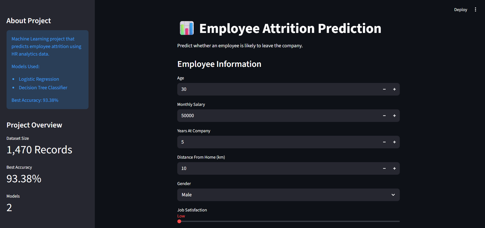
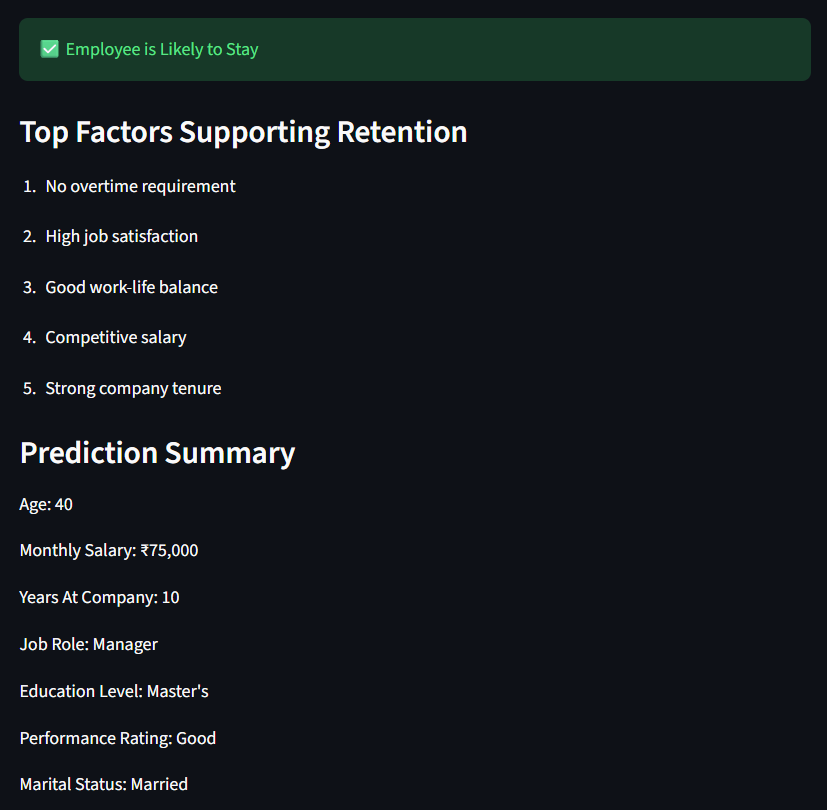
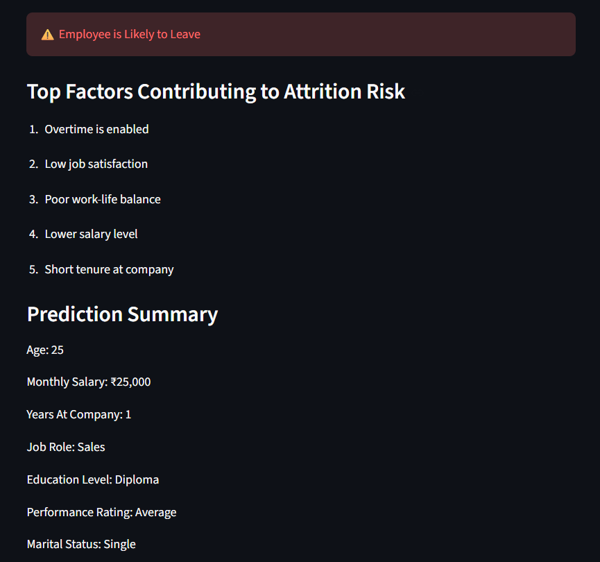

# Employee Attrition Prediction

## Live Demo

Try the application here:

https://hr-employee-attrition-prediction-9g7qdbpqmqvdykky8vhsas.streamlit.app

## Project Overview

Employee attrition is a major challenge for organizations as it impacts productivity, recruitment costs, and overall business performance.

This project uses Machine Learning techniques to predict whether an employee is likely to leave the company based on demographic, performance, and workplace-related factors.

The project includes:

- Data Cleaning
- Exploratory Data Analysis (EDA)
- Feature Engineering
- Machine Learning Model Development
- Streamlit Web Application

---

## Dataset

The dataset contains employee information such as:

- Age
- Gender
- Salary
- Job Satisfaction
- Work-Life Balance
- Years at Company
- Overtime
- Distance From Home
- Education Level
- Performance Rating
- Job Role
- Marital Status

Target Variable:

- Attrition (Yes/No)

---

## Technologies Used

- Python
- Pandas
- NumPy
- Matplotlib
- Seaborn
- Scikit-learn
- Streamlit
- Joblib

---

## Machine Learning Models

### Logistic Regression

Accuracy: 85.03%

### Decision Tree Classifier

Accuracy: 93.38%

Best Model: Decision Tree Classifier

---

## Key Insights

- Employees with lower job satisfaction show higher attrition rates.
- Overtime significantly increases attrition risk.
- Work-life balance plays an important role in employee retention.
- Years at company influence employee turnover behavior.

---

## Application Features

- User-friendly interface
- Real-time attrition prediction
- Employee information summary
- Probability-based predictions

---

## Screenshots

<h3>Application Home</h3>


<h3>Employee Likely to Stay</h3>


<h3>Employee Likely to Leave</h3>


## Project Structure

```

HR-Employee-Attrition-Prediction
│
├── app.py
├── hr_model.joblib
├── employee_attrition.csv
├── requirements.txt
├── README.md
│
├── notebook
│ └── HR_project_DTC.ipynb
│
└── screenshots

```

---

## Run Locally

```bash
pip install -r requirements.txt
streamlit run app.py
```

---

## Author

Ayushi Dhimmar
"# HR-Employee-Attrition-Prediction"
